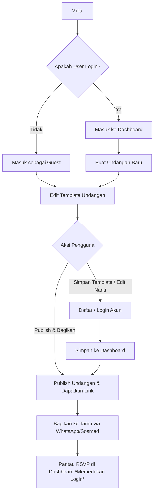
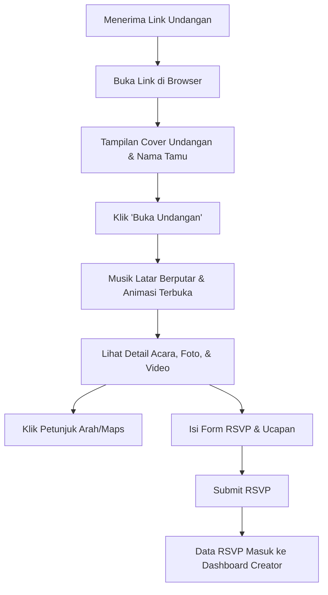
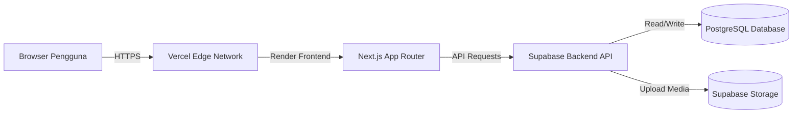
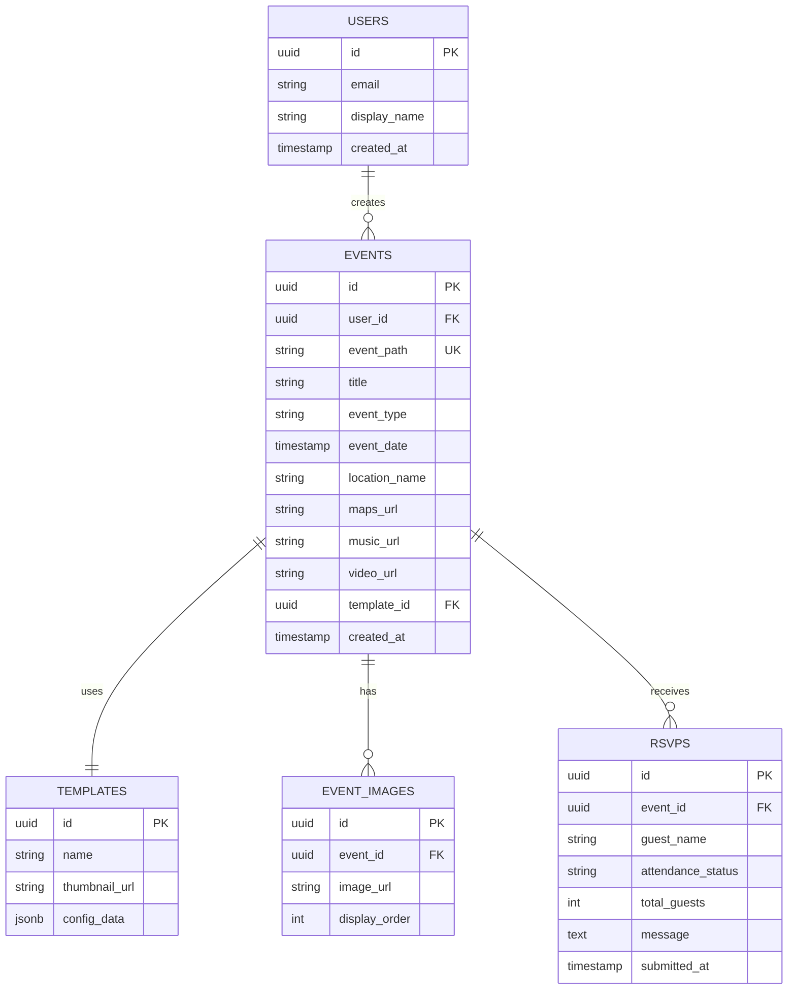

# PRD — UndangKuy: Platform Undangan Digital Interaktif

## 1. Overview

### Background
Undangan fisik memerlukan biaya cetak dan distribusi yang tinggi serta kurang ramah lingkungan. Di era digital, undangan digital menjadi alternatif populer karena praktis, interaktif, dan dapat dibagikan secara instan. Namun, banyak platform undangan digital yang berbayar atau memiliki batasan fitur yang ketat pada versi gratisnya. 

### Solution
**UndangKuy** adalah platform pembuat undangan digital (pernikahan, ulang tahun, tasyakuran, dan acara lainnya) yang **100% gratis**. Platform ini memungkinkan pengguna membuat undangan yang sangat interaktif dengan animasi kaya efek, musik latar, galeri foto/video, integrasi peta lokasi, dan sistem RSVP mandiri tanpa biaya langganan.

### Goals
*   Menyediakan platform pembuatan undangan digital gratis yang mudah digunakan oleh siapa saja (bahkan tanpa keahlian teknis).
*   Menghadirkan template undangan yang dinamis, responsif, dan kaya akan animasi visual yang menarik.
*   Mempermudah manajemen tamu melalui sistem RSVP yang terintegrasi di dalam dashboard pengguna.

---

## 2. Target Users

1.  **Event Creator (Pembuat Acara):**
    *   Individu yang sedang merencanakan pernikahan, ulang tahun, tasyakuran, atau acara keluarga lainnya.
    *   Membutuhkan undangan cepat, murah (gratis), dan terlihat profesional.
2.  **Event Guest (Tamu Undangan):**
    *   Penerima undangan yang akan mengakses halaman undangan melalui perangkat mobile atau desktop.
    *   Membutuhkan informasi detail acara (waktu, lokasi, peta) dan mengisi RSVP dengan mudah.

---

## 3. Requirements (Functional & Non-Functional)

### Functional Requirements
*   **Sistem Autentikasi:** Pengguna dapat mendaftar/masuk menggunakan Email/Password atau Google OAuth. Tersedia juga mode *Guest* untuk mencoba editor, mempublikasikan (publish) undangan, dan membagikan tautan tanpa mendaftar. Namun, untuk menyimpan draf template ke akun dan mengelolanya di dashboard, pengguna harus mendaftar/masuk terlebih dahulu.
*   **Dashboard Pengguna:** Tempat mengelola daftar undangan yang telah dibuat dan melihat rekapitulasi RSVP dari tamu.
*   **Template Editor (WYSIWYG/Form-Based):** 
    *   Mengubah teks (nama mempelai/penyelenggara, tanggal, waktu, lokasi).
    *   Mengunggah media (foto galeri, musik latar, video) atau menggunakan tautan sematan (embed link) untuk musik (seperti Spotify, SoundCloud, YouTube) dan video (seperti YouTube, Vimeo).
    *   Mengintegrasikan Google Maps (lokasi acara).
    *   Membuat tautan kustom dengan nama tamu khusus.
*   **Animasi Interaktif:** Halaman undangan harus mendukung efek transisi halaman (seperti membuka amplop), animasi teks/gambar masuk, musik latar otomatis (*autoplay* setelah interaksi pertama), dan efek visual (seperti guguran bunga/salju).
*   **Sistem RSVP:** Form bagi tamu untuk mengisi nama, status kehadiran (hadir/tidak), jumlah tamu yang dibawa, dan ucapan/doa.
*   **Pembagian Tautan (Share Link):** Pembuatan tautan unik berbasis path dengan parameter nama tamu untuk personalisasi.

### Non-Functional Requirements
*   **Validasi Ukuran File (File Size Limit):**
    *   Foto/Gambar: Maksimal 5 MB per file.
    *   Musik (MP3): Maksimal 10 MB per file (jika menggunakan fitur unggah langsung).
    *   Video: Maksimal 20 MB per file (jika menggunakan fitur unggah langsung).
*   **Performa & Aksesibilitas:** Halaman undangan harus memuat kurang dari 2 detik pada jaringan 4G karena aset media akan dioptimalkan (kompresi otomatis).
*   **Desain Mobile-First:** Minimal 90% tamu undangan akan membuka link melalui ponsel pintar, sehingga tampilan mobile wajib responsif dan mulus.
*   **Ketersediaan (Availability):** Sistem harus dapat diakses 24/7 dengan keandalan tinggi, terutama saat hari H acara ketika trafik kunjungan tamu meningkat.

---

## 4. Core Features (MVP)

1.  **Autentikasi & Guest Mode:** Login cepat dengan Google atau Email. Pengguna dengan status *Guest* dapat langsung membuat, mempublikasikan (publish), dan membagikan link undangan. Namun, mereka harus mendaftar/masuk untuk menyimpan template tersebut ke dalam akun/dashboard agar bisa diedit kembali di kemudian hari.
2.  **Dashboard Utama:** Menampilkan ringkasan undangan aktif, statistik RSVP (jumlah hadir, tidak hadir, belum konfirmasi), dan daftar ucapan tamu.
3.  **Interactive Template Engine:** Koleksi template gratis dengan berbagai tema (Modern, Rustik, Tradisional, Minimalis) yang dilengkapi animasi transisi halus.
4.  **Custom URL Generator:** Format link menggunakan struktur path: `undangkuy.com/nama-acara?to=Nama+Tamu`.
5.  **Media & Embed Manager:** Fitur unggah foto galeri dengan validasi ukuran file di sisi klien dan server, serta opsi untuk mengunggah atau menggunakan tautan sematan (embed link) pihak ketiga untuk musik latar dan video.
6.  **RSVP & Wishlist Board:** Form interaktif di halaman undangan yang langsung memperbarui data di dashboard pemilik acara secara *real-time*.

---

## 5. User Flow

### Flow 1: Pembuat Undangan (Creator Flow)

### Flow 2: Tamu Undangan (Guest Flow)

---

## 6. Architecture

Aplikasi menggunakan arsitektur modern berbasis Serverless dan Client-Side Rendering untuk memastikan kecepatan loading animasi serta efisiensi biaya operasional (karena platform ini gratis).

---

## 7. Database Schema

---

## 8. UI Pages & Navigation

### 1. Landing Page (`/`)
*   **Hero Section:** Judul menarik, deskripsi platform, dan tombol CTA "Buat Undangan Gratis".
*   **Template Showcase:** Galeri preview template interaktif dengan filter kategori (Pernikahan, Ultah, Tasyakuran).
*   **Features Section:** Penjelasan fitur utama (RSVP, Musik, Galeri, Animasi).

### 2. Auth Pages (`/login` & `/register`)
*   Form input email dan password.
*   Tombol "Masuk dengan Google" untuk kemudahan akses.

### 3. Dashboard (`/dashboard`)
*   **Daftar Undangan:** Grid yang menampilkan undangan yang telah dibuat beserta statusnya (Draft/Published).
*   **Statistik RSVP:** Grafik sederhana atau angka akumulasi status kehadiran tamu.
*   **Tombol Aksi:** Edit, Hapus, Lihat Undangan, dan Salin Link.

### 4. Editor Page (`/editor/[event_id]`)
*   **Panel Kiri (Form Pengisian):**
    *   *Tab Info Acara:* Nama mempelai/acara, tanggal, waktu, lokasi, link Google Maps.
    *   *Tab Media:* Upload foto (maks 5MB), upload musik (maks 10MB) atau embed link musik (Spotify/SoundCloud/YouTube), upload video (maks 20MB) atau embed link video (YouTube/Vimeo).
    *   *Tab Desain:* Pilihan template dan efek animasi latar belakang.
*   **Panel Kanan (Live Preview):** Tampilan *real-time* responsif mobile dari undangan yang sedang diedit.

### 5. Public Invitation Page (`/[event_path]`)
*   Halaman undangan interaktif yang diakses oleh tamu.
*   Menampilkan animasi pembuka (amplop virtual), musik latar dengan tombol *mute/unmute*, galeri foto, peta lokasi, form RSVP, dan papan ucapan/doa dari tamu.

---

## 9. Tech Stack

*   **Frontend Framework:** Next.js (React) dengan App Router untuk performa SEO dan Server-Side Rendering (SSR) pada halaman undangan publik.
*   **Styling & Animasi:** Tailwind CSS untuk tata letak responsif, didukung oleh **Framer Motion** dan **GSAP** untuk membuat animasi transisi, efek *parallax*, dan efek visual interaktif yang kaya.